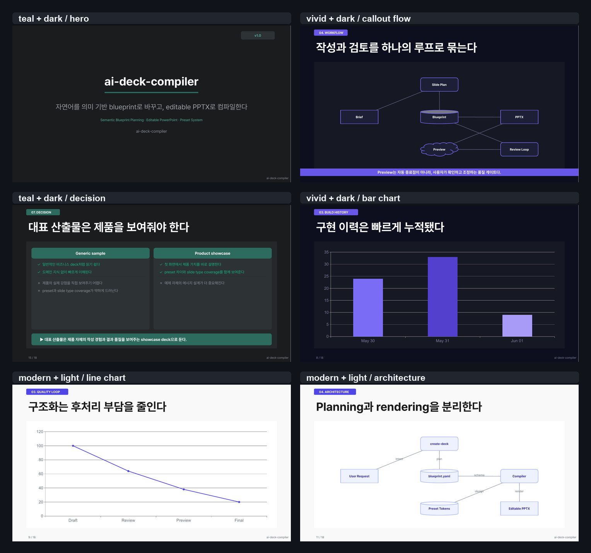
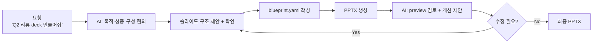

# AI-Native Presentation Engineering Framework

> "Q2 성과 리뷰 deck 만들어줘. 임원진 대상 15분 발표야."
>
> 한 문장으로 요청하면 AI가 구조를 협의하고, 슬라이드를 기획하고, **편집 가능한 PowerPoint 파일**을 만들어줍니다.

`ai-deck-compiler`는 Claude Code, Codex, Cursor, Claude App과 함께 쓰는 AI-first PPT 생성 도구입니다.
AI와의 대화로 발표 내용을 빠르게 정제하고, 레이아웃과 디자인은 엔진이 일관되게 처리합니다.



대표 showcase blueprint, PPTX, export PDF는 [examples/results](examples/results/)에서 바로 확인할 수 있습니다.
PDF는 PPTX에서 `npm run export-pdf`로 반출한 결과물입니다.

상세 사용법은 [USER-MANUAL](docs/USER-MANUAL.md), 시스템 구조는 [SYSTEM-MANUAL](docs/SYSTEM-MANUAL.md)을 보세요.

---

## 어떻게 쓰나요?

AI에게 요청하면 됩니다. 나머지는 AI와 엔진이 처리합니다.
Claude Code에서는 slash command를 먼저 단독 실행하고, 이어지는 질문에 내용을 답변합니다.

Command:

```text
/create-deck
```

Prompt 1: Claude Code 질문에 답변

```text
Q2 엔지니어링 성과 리뷰 deck 만들어줘.
청중은 임원진, 15분 발표야.
핵심 메시지는 "플랫폼 안정성 개선, 다음 분기 배포 자동화 투자 필요"야.
dark theme으로 해줘.
```

AI가 발표 구조를 제안하고 확인을 받습니다. 승인하면 blueprint를 작성하고 PPTX를 바로 생성합니다. 생성된 파일은 PowerPoint에서 바로 편집할 수 있습니다.

### 사용 환경

| 환경 | 시작 방법 |
| --- | --- |
| Claude Code | `/create-deck` 입력 후 요청 |
| Codex CLI / App | repo skill `create-deck` 로드 후 요청 |
| Cursor | product skill intent로 요청하면 `skills/create-deck.md` 절차 참조 |
| Claude App | `skills/create-deck.md` 내용 참조 후 요청 |

Codex App에서 처음 시작한다면 아래처럼 말하면 됩니다.

Prompt 2: Codex App에서 product skill routing 사용

```text
이 repo의 AGENTS.md를 읽고 Product Skill Routing에 따라 create-deck 절차로 PPT 작성을 시작해줘.

Q2 엔지니어링 성과 리뷰 deck을 만들고 싶어.
청중은 임원진이고, 발표 시간은 15분이야.
핵심 메시지는 "플랫폼 안정성이 개선됐고 다음 분기에는 배포 자동화 투자가 필요하다"야.
dark theme, 간결한 executive briefing 톤으로 진행해줘.
```

Cursor에서는 아래처럼 product skill intent를 직접 말하면 됩니다.

Prompt 3: Cursor에서 product skill routing 사용

```text
이 repo의 Cursor product skill routing에 따라 skills/create-deck.md 절차로 PPT 작성을 시작해줘.

Q2 엔지니어링 성과 리뷰 deck을 만들고 싶어.
청중은 임원진이고, 발표 시간은 15분이야.
먼저 슬라이드 구조를 제안하고, 승인 후 blueprint와 PPTX를 생성해줘.
```

---

## 왜 이 도구인가요?

AI에게 "PPT 만들어줘"라고 맡기면 보통 이런 문제가 생깁니다.

- 매번 레이아웃이 달라져 재현성이 낮다.
- 차트, 표, 도형이 이미지로 들어가 편집이 어렵다.
- 생성 후 사람이 다시 PPT를 다듬느라 자동화 효과가 줄어든다.

이 도구에서 **사용자가 하는 일은 두 가지**입니다.

1. AI와 대화한다 — 주제, 청중, 핵심 메시지, 슬라이드 구성을 협의합니다.
2. 결과물을 검토한다 — `blueprint.yaml` 초안을 확인하고 수정 방향을 말합니다.

레이아웃, 좌표, 색상, 타이포그래피는 엔진이 design preset에 따라 처리합니다. AI가 즉흥적으로 결정하지 않으므로 같은 blueprint와 preset이면 같은 구조와 레이아웃 규칙으로 생성됩니다.

---

## 빠른 시작

### 요구사항

- Node.js 18+, npm 9+
- Pretendard 폰트 권장 ([설치 안내](https://github.com/orioncactus/pretendard)) — 미설치 시 시스템 fallback 폰트 사용
- Optional PDF export: LibreOffice (`brew install --cask libreoffice`)
- Optional preview: LibreOffice + `pdftoppm` (`brew install poppler`)

### 설치

```bash
git clone https://github.com/kyungseo/ai-deck-compiler.git
cd ai-deck-compiler
npm install
```

설치 후 Claude Code를 열고 `/create-deck`을 입력하면 바로 시작할 수 있습니다.

> CLI로 예제를 직접 실행해보려면(디버깅·확인 용도):
> ```bash
> npm run validate -- --blueprint examples/sample/blueprint.yaml
> npm run deck -- --blueprint examples/sample/blueprint.yaml
> ```

---

## AI와 대화하면 어떻게 되나요?

AI는 발표 요청을 받으면 아래 흐름으로 진행합니다.



중간에 사용자가 "3번 슬라이드 내용 바꿔줘", "KPI 항목 추가해줘"라고 말하면 AI가 blueprint를 수정하고 다시 컴파일합니다. 반복이 빠르기 때문에 초안에서 완성까지 한 세션 안에 끝낼 수 있습니다.

---

## 주요 기능

| 기능 | 사용자 관점 |
| --- | --- |
| 대화식 deck 생성 | 주제·청중·메시지를 말하면 AI가 슬라이드 구조를 제안하고 초안을 만듭니다. |
| Semantic blueprint planning | AI가 내용을 읽고 chart/kpi/table, architecture/flow, decision/summary, callout 중 적절한 표현을 고릅니다. |
| 편집 가능한 PPTX | chart, table, shape, text가 이미지가 아닌 PowerPoint 객체로 생성됩니다. 생성 후 직접 편집할 수 있습니다. |
| 일관된 레이아웃 | 같은 blueprint와 preset이면 같은 구조와 레이아웃 규칙으로 생성됩니다. AI가 좌표나 디자인을 즉흥 결정하지 않습니다. |
| Preview 기반 검토 | AI가 슬라이드 PNG를 보고 텍스트 밀도, 가독성, 구성을 검토합니다. |
| PDF 내보내기 | `/export-pdf`로 PPTX를 PDF로 바로 변환합니다. LibreOffice 필요. |
| 아키텍처 슬라이드 | `/generate-architecture-slide`로 자연어 설명에서 node/edge/zone을 추출해 다이어그램 슬라이드를 생성합니다. |
| 16종 슬라이드 타입 | hero, agenda, kpi, chart, table, architecture, timeline, decision 등 발표에 필요한 타입이 미리 정의되어 있습니다. |
| 멀티툴 지원 | Claude Code, Codex CLI/App, Cursor, Claude App에서 동일한 canonical skill 문서를 기준으로 작동합니다. |

---

## Semantic Blueprint Planning

AI는 자연어 요청이나 source 문서를 곧바로 bullet slide로 옮기지 않고, 먼저 의미를 구조로 바꿉니다.

| 내용의 성격 | 생성되는 표현 |
| --- | --- |
| 핵심 숫자 3~4개 | `kpi` |
| 시간 추세·항목 비교·구성비 | `chart` |
| 행/열 기반 비교 | `table` |
| 시스템 구성·의존성 | `architecture` |
| 단계별 절차·업무 흐름 | `flow` |
| 선택지·승인·권고안 | `decision` |
| deck 전체 결론 | `summary.takeaways` |
| 슬라이드 내부 핵심 문장 | `content` / `flow`의 `callout` |

renderer는 여전히 deterministic합니다. AI는 `blueprint.yaml`의 의미 구조를 작성하고, 엔진은 preset과 slide type 규칙에 따라 editable PowerPoint 객체를 생성합니다.

---

## AI가 작성하는 blueprint 예시

아래는 AI가 요청을 받고 작성하는 `blueprint.yaml` 초안의 일부입니다. 사용자는 이 파일을 검토하고 수정 방향을 말합니다.

```yaml
deck:
  title: Platform Modernization Strategy
  design: teal
  theme: dark
  version: "1.0"
  author: Kyungseo Park
  audience: Engineering Leadership

slides:
  - id: hero
    type: hero
    title: Platform Modernization Strategy
    subtitle: From monolith operations to cloud-native delivery

  - id: kpis
    type: kpi
    title: Current Performance Baseline
    kpis:
      - label: Deploy Frequency
        value: "4/month"
        delta: "-60% vs target"
        trend: down
```

전체 schema는 [schemas/blueprint.schema.json](schemas/blueprint.schema.json), 더 많은 예제는 `examples/` 디렉터리를 참고하세요.

---

## 지원 Slide Type

현재 16개 slide type을 지원합니다.

| 분류 | Type |
| --- | --- |
| Core | `hero`, `agenda`, `content`, `two-column`, `summary`, `closing` |
| Data | `kpi`, `chart`, `table`, `comparison` |
| Structure | `section-divider`, `timeline`, `flow`, `decision`, `appendix` |
| Diagram | `architecture` |

---

## Design Preset

AI workflow 기본 추천은 `teal + dark`입니다.

| Preset | 특징 | 추천 용도 |
| --- | --- | --- |
| `teal` | charcoal-dark + deep teal accent, AI-native | **신규 deck 기본 추천** (dark 우선) |
| `vivid` | deep-navy + vivid purple, bold contrast | secondary/experimental (dark 우선) |
| `modern` | modern, minimal, technical, light/dark 지원 | light 테마 수요, 기존 blueprint 호환 |

| 항목 | 값 |
| --- | --- |
| Canvas | 13.33" × 7.5" (`LAYOUT_WIDE`) |
| Theme | `dark` (teal/vivid 권장), `light` (modern 권장) |
| Default author | `ai-deck-compiler (Kyungseo.Park@gmail.com)` |
| Brand footer | `ai-deck-compiler` |

`design: modern`이 light/business tone의 canonical preset입니다. 기존 `design: default-modern` blueprint도 alias로 계속 동작합니다.
회사 브랜드에 맞춘 custom preset은 [USER-MANUAL](docs/USER-MANUAL.md)의 customization 절차와 `skills/customize-preset.md`를 참고하세요.

---

## 프로젝트 구조

```text
src/
  schema/blueprint.ts        # Zod schema for 16 slide types
  compiler/parser.ts         # YAML -> Blueprint
  compiler/compiler.ts       # Blueprint + tokens -> pptxgenjs
  templates/registry.ts      # TemplateRegistry
  templates/slides/          # slide renderers
  design/resolver.ts         # preset -> ResolvedDesignTokens
  design/presets/            # design presets
  cli/validate.ts            # npm run validate
  cli/deck.ts                # npm run deck
  cli/preview.ts             # npm run preview (PPTX → PNG)
  cli/export-pdf.ts          # npm run export-pdf (PPTX → PDF)
  cli/lib/tools.ts           # LibreOffice / pdftoppm 탐색 유틸리티

skills/                      # canonical AI product skills
.claude/commands/            # Claude Code wrappers
.agents/skills/              # Codex skill wrappers
docs/                        # manuals, plans, work tracking
examples/
  sample/                    # 엔지니어링 전략 발표 — hero, agenda, kpi, architecture, chart, timeline, summary, appendix
  strategy/                  # 경영진 전략 보고 — hero, agenda, content, kpi, decision, summary
  data-report/               # 분기 데이터 리뷰 — kpi, chart × 2, table, summary
  semantic-planning/         # semantic component selection 예제 — callout, kpi, chart, architecture, decision
  results/                   # 대표 showcase blueprint, PPTX, export PDF, gallery
schemas/                     # generated JSON Schema
```

---

## 개발

```bash
npm run typecheck
npm test
npm run validate -- --blueprint examples/sample/blueprint.yaml
npm run deck -- --blueprint examples/sample/blueprint.yaml --output output/sample-v1.0.pptx
```

현재 기준: 51개 테스트.

---

## 문서

| 문서 | 용도 |
| --- | --- |
| [USER-MANUAL](docs/USER-MANUAL.md) | 사용자용 — AI 요청 방법, 설치, customization 절차 |
| [SYSTEM-MANUAL](docs/SYSTEM-MANUAL.md) | 개발자용 — 구조, renderer 구현, 유지보수 절차 |
| [PLAN](docs/PLAN.md) | 제품 설계, phase 계획, roadmap |
| [STATUS](docs/STATUS.md) | 현재 active work dashboard |

---

## 한계와 제약

- **Design preset**: `teal`(AI 기본 추천, dark), `vivid`(secondary, dark), `modern`(light/legacy) 3종 제공. `default-modern`은 legacy alias로 지원됩니다. `teal`/`vivid`는 callout bar를 지원하며, legend pill은 후속 후보입니다.
- **Callout**: `teal`과 `vivid`는 content/flow slide의 `callout` field를 하단 강조 bar로 렌더링합니다. `modern`은 light tone에 맞는 별도 treatment 후보입니다.
- **Preview**: LibreOffice + poppler 의존. Keynote, Google Slides 직접 지원 없음.
- **AI 외부 검색**: AI-research-first mode의 실제 외부 검색은 도구 환경에 따라 제한됩니다.

---

## 기여

버그 리포트와 기능 제안은 [GitHub Issues](https://github.com/kyungseo/ai-deck-compiler/issues)에서 환영합니다.
기여 가이드(`CONTRIBUTING.md`)는 준비 중입니다.

---

## 라이선스

Apache License 2.0 — [LICENSE](LICENSE) 참조.

---

## 어떻게 만들었나

`ai-deck-compiler`는 [ai-workflow-harness](https://github.com/kyungseo/ai-workflow-harness)를 scaffold하여 구현된 실제 적용 사례입니다.

Work 파일, `STATUS.md` dashboard, Claude/Codex entrypoint, review/close workflow를 한 repo 안에서 정렬하는 방식이 궁금하다면
[ai-workflow-harness](https://github.com/kyungseo/ai-workflow-harness)를 확인하세요.
