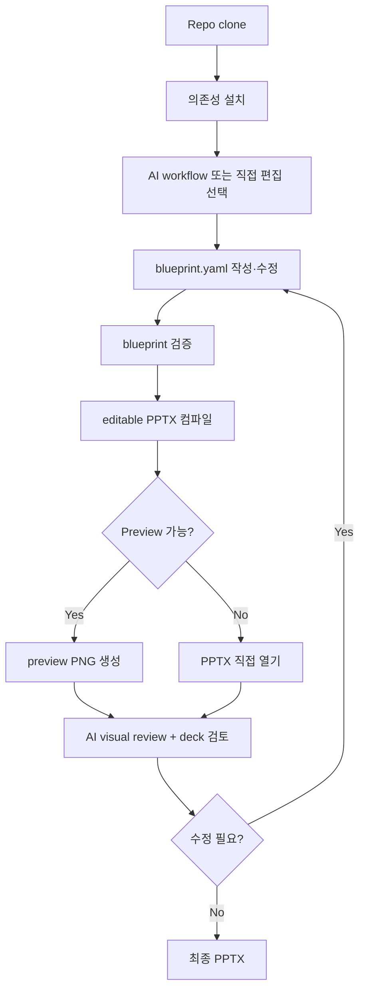

# AI-Native Presentation Engineering Framework

> AI가 `blueprint.yaml`로 발표 의도를 쓰고, TypeScript 엔진이 design preset과 template registry로 **규칙 기반 editable PPTX**를 생성합니다.

`ai-deck-compiler`는 AI와 함께 PPT를 만들되, 레이아웃과 렌더링은 규칙 기반 엔진이 담당하도록 분리한 presentation compiler입니다.
AI는 스토리, 메시지, 데이터, 구조를 작성하고, 엔진은 `blueprint.yaml + design preset`을 컴파일해 PowerPoint에서 편집 가능한 `.pptx`를 만듭니다.

```text
AI-authored intent
  + Deck Specification DSL (blueprint.yaml)
  + design preset / tokens
  + template registry
  = editable, repeatable PPTX
```

> **DSL(Domain Specific Language)**: 특정 목적에 맞게 설계된 전용 기술 언어. `blueprint.yaml`은 "어떤 슬라이드를 어떤 내용으로 만들지"를 기술하는 deck 전용 DSL입니다.

상세 사용법은 [USER-MANUAL](docs/USER-MANUAL.md), 시스템 구조와 유지보수 절차는 [SYSTEM-MANUAL](docs/SYSTEM-MANUAL.md)을 보세요.

---

## 왜 이 도구인가요?

AI에게 "PPT 만들어줘"라고 맡기면 보통 다음 문제가 생깁니다.

- 매번 레이아웃이 달라져 재현성이 낮다.
- 차트, 표, 도형이 이미지로 들어가 편집이 어렵다.
- AI가 좌표와 디자인을 즉흥적으로 결정해 브랜드 일관성이 깨진다.
- 생성 후 사람이 다시 PPT를 다듬느라 자동화 효과가 줄어든다.

이 프로젝트는 그 경계를 명확히 나눕니다.

| AI가 담당 | TypeScript 엔진이 담당 |
| --- | --- |
| 목적, 청중, 스토리, slide content | schema validation |
| `blueprint.yaml` 작성과 수정 | design preset / token 적용 |
| source 요약과 narrative 구성 | template registry 기반 PPTX 렌더링 |
| preview를 보고 개선 제안 | native editable PowerPoint 객체 생성 |

---

## 빠른 시작

### 요구사항

- Node.js 18+
- npm 9+
- Pretendard 폰트 권장 — 미설치 시 시스템 fallback 폰트로 렌더링됨 ([설치 안내](https://github.com/orioncactus/pretendard))
- Optional preview: LibreOffice + `pdftoppm`(poppler)

### 설치

```bash
git clone https://github.com/kyungseo/ai-deck-compiler.git
cd ai-deck-compiler
npm install
```

### 시작 방법 — AI 워크플로우 (권장)

설치 후 AI에게 요청하는 것이 가장 빠른 시작입니다.

| 환경 | 진입 방법 |
| --- | --- |
| Claude Code | `/create-deck` 입력 |
| Codex CLI/App | repo skill `create-deck` 로드 후 요청 |
| Claude App | `skills/create-deck.md` 내용 참조 후 요청 |

```text
# Claude Code 예시
/create-deck

Q2 엔지니어링 성과 리뷰 deck을 만들어줘.
청중은 임원진이고, 15분 발표야. dark theme.
```

AI가 구조 협의 → `blueprint.yaml` 작성 → `npm run deck` 실행 → PPTX 생성까지 진행합니다.

### 시작 방법 — CLI 직접 실행

AI 없이 blueprint를 직접 작성하거나, 동작을 확인할 때 사용합니다.

```bash
# blueprint 검증
npm run validate -- --blueprint examples/sample/blueprint.yaml

# PPTX 생성
npm run deck -- \
  --blueprint examples/sample/blueprint.yaml \
  --output output/sample-v1.0.pptx

# Preview (LibreOffice + pdftoppm 필요)
npm run preview -- output/sample-v1.0.pptx --out output/sample-preview
```

---

## 전체 워크플로우

> 아래 다이어그램은 [Mermaid](https://mermaid.js.org/) 문법으로 작성되어 GitHub에서 바로 렌더링됩니다.



---

## AI 환경별 빠른 설정

| 환경 | 시작 방법 | 설명 |
| --- | --- | --- |
| Claude Code | `/create-deck`, `/generate-blueprint`, `/review-deck` | `.claude/commands/*.md` wrapper 사용 |
| Codex CLI | repo skill `create-deck` 로드 | `.agents/skills/{name}/SKILL.md` 사용 |
| Codex App | repo-local skill 또는 SKILL.md 수동 로드 | Manual load 기준으로 지원 |
| Claude App | `skills/*.md` 내용을 복사/참조 | native slash command 실행은 가정하지 않음 |
| Manual CLI | `blueprint.yaml` 직접 편집 후 `npm run validate`, `npm run deck` 실행 | AI 없이도 사용 가능 |

권장 AI 진입점:

- End-to-end deck 생성: `skills/create-deck.md`
- Blueprint만 생성: `skills/generate-blueprint.md`
- 검토와 개선: `skills/review-deck.md`
- 브랜딩·custom preset: `skills/customize-preset.md`

---

## 주요 기능

| 기능 | 설명 |
| --- | --- |
| 규칙 기반 PPTX 생성 | 같은 `blueprint.yaml`과 preset은 같은 PPTX를 생성합니다. |
| Deck Specification DSL | `blueprint.yaml`은 기획서이자 compiler가 읽는 deck spec입니다. |
| 편집 가능한 native 객체 | chart, table, shape, text를 이미지가 아닌 PowerPoint 객체로 생성합니다. |
| Design preset과 token | 색상, typography, spacing, brand footer를 preset으로 관리합니다. |
| Template registry | slide type별 renderer가 등록되어 미등록 layout을 즉흥 생성하지 않습니다. |
| 브랜딩 지원 | 개인/회사 author, brand footer, custom preset 방향을 workflow에 반영할 수 있습니다. |
| Metadata·버전 매핑 | `deck.title`, `deck.author`, `deck.version`, `deck.audience`를 PPTX document properties에 반영합니다. |
| Preview 기반 검토 | PPTX를 PNG로 preview한 뒤 AI가 시각적 밀도, overflow, 가독성을 검토할 수 있습니다. |
| PDF 내보내기 | `/export-pdf` 또는 `npm run export-pdf`로 PPTX를 PDF로 변환합니다. LibreOffice 필요. |
| 멀티툴 워크플로우 | Claude Code, Codex CLI/App, Claude App-compatible manual flow를 지원합니다. |

---

## Blueprint 예시

```yaml
deck:
  title: Platform Modernization Strategy
  design: default-modern
  theme: dark
  version: "1.0"
  author: Platform Team
  audience: Engineering Leadership

slides:
  - id: hero
    type: hero
    title: Platform Modernization Strategy
    subtitle: From monolith operations to cloud-native delivery

  - id: kpis
    type: kpi
    title: Current Performance Baseline
    kpis:
      - label: Deploy Frequency
        value: "4/month"
        delta: "-60% vs target"
        trend: down
```

전체 schema는 [schemas/blueprint.schema.json](schemas/blueprint.schema.json)을 참고하세요.
더 많은 예제는 `examples/` 디렉터리를 참고하세요.

---

## 지원 Slide Type

현재 16개 slide type을 지원합니다.

| 분류 | Type |
| --- | --- |
| Core | `hero`, `agenda`, `content`, `two-column`, `summary`, `closing` |
| Data | `kpi`, `chart`, `table`, `comparison` |
| Structure | `section-divider`, `timeline`, `flow`, `decision`, `appendix` |
| Diagram | `architecture` |

---

## Design Preset

기본 preset은 `default-modern`입니다.

| 항목 | 값 |
| --- | --- |
| Canvas | 13.33" × 7.5" (`LAYOUT_WIDE`) |
| Theme | `light`, `dark` |
| Default author | `ai-deck-compiler (Kyungseo.Park@gmail.com)` |
| Brand footer | `ai-deck-compiler` |

Preset 파일:

```text
src/design/presets/default-modern/
  tokens.json
  ppt-design.md
  ppt-components.md
  ppt-layouts.md
  ppt-chart-rules.md
```

회사 브랜드에 맞춘 custom preset은 [USER-MANUAL](docs/USER-MANUAL.md)의 customization 절차와 `skills/customize-preset.md`를 참고하세요.

---

## 프로젝트 구조

```text
src/
  schema/blueprint.ts        # Zod schema for 16 slide types
  compiler/parser.ts         # YAML -> Blueprint
  compiler/compiler.ts       # Blueprint + tokens -> pptxgenjs
  templates/registry.ts      # TemplateRegistry
  templates/slides/          # slide renderers
  design/resolver.ts         # preset -> ResolvedDesignTokens
  design/presets/            # design presets
  cli/validate.ts            # npm run validate
  cli/deck.ts                # npm run deck
  cli/preview.ts             # npm run preview

skills/                      # canonical AI product skills
.claude/commands/            # Claude Code wrappers
.agents/skills/              # Codex skill wrappers
docs/                        # manuals, plans, work tracking
examples/
  sample/                    # 엔지니어링 전략 발표 — hero, agenda, kpi, architecture, chart, timeline, summary, appendix
  strategy/                  # 경영진 전략 보고 — hero, agenda, content, kpi, decision, summary
  data-report/               # 분기 데이터 리뷰 — kpi, chart × 2, table, summary
schemas/                     # generated JSON Schema
```

---

## 개발

```bash
npm run typecheck
npm test
npm run validate -- --blueprint examples/sample/blueprint.yaml
npm run deck -- --blueprint examples/sample/blueprint.yaml --output output/sample-v1.0.pptx
```

현재 기준: 43개 테스트.

Metadata 검증:

```bash
unzip -p output/sample-v1.0.pptx docProps/core.xml | rg "dc:title|dc:creator|dc:subject|cp:revision"
unzip -p output/sample-v1.0.pptx docProps/app.xml | rg "Company|Application"
```

---

## 문서

| 문서 | 용도 |
| --- | --- |
| [USER-MANUAL](docs/USER-MANUAL.md) | 초보 사용자용 설치, PPT 생성, AI 요청, customization 절차 |
| [SYSTEM-MANUAL](docs/SYSTEM-MANUAL.md) | 초보 개발자용 architecture, 구현 구조, 유지보수 절차 |
| [PLAN](docs/PLAN.md) | 제품 설계, phase 계획, roadmap |
| [STATUS](docs/STATUS.md) | 현재 active work dashboard |

---

## 한계와 제약

- **Design preset**: 현재 `default-modern` 1종만 제공됩니다. `minimal-dark`, `enterprise-clean`은 backlog 예정입니다.
- **Preview**: LibreOffice + poppler 의존. Keynote, Google Slides 직접 지원 없음.
- **발표자 노트**: `slide.notes`가 PowerPoint 발표자 노트로 저장되지만 슬라이드에 시각적으로 렌더링되지 않습니다.
- **AI 외부 검색**: AI-research-first mode의 실제 외부 검색은 도구 환경에 따라 제한됩니다.

---

## 기여

버그 리포트와 기능 제안은 [GitHub Issues](https://github.com/kyungseo/ai-deck-compiler/issues)에서 환영합니다.
기여 가이드(`CONTRIBUTING.md`)는 준비 중입니다.

---

## 라이선스

Apache License 2.0 — [LICENSE](LICENSE) 참조.

---

## ai-workflow-harness로 구현됨

`ai-deck-compiler`는 [ai-workflow-harness](https://github.com/kyungseo/ai-workflow-harness)를 scaffold하여 구현된 실제 적용 사례입니다.

Work 파일, `STATUS.md` dashboard, Claude/Codex entrypoint, review/close workflow를 한 repo 안에서 정렬하는 방식이 궁금하다면
[ai-workflow-harness](https://github.com/kyungseo/ai-workflow-harness)를 확인하세요.
