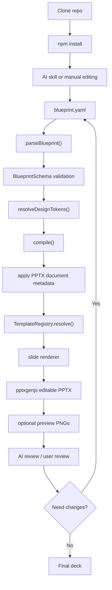

# System Manual — ai-deck-compiler

이 문서는 `ai-deck-compiler`를 유지보수하거나 확장하려는 개발자를 위한 시스템 안내서입니다.
사용자 관점의 설치, AI 요청, customization 방법은 [USER-MANUAL](USER-MANUAL.md)을 보세요.

---

## 1. System Overview

`ai-deck-compiler`는 `blueprint.yaml`을 editable PPTX로 컴파일하는 TypeScript 기반 presentation compiler입니다.

핵심 경계:

```text
AI = 의도·내용 작성 (intent/content authoring)
Engine = 규칙 기반 렌더링 (deterministic rendering)
```

AI는 `blueprint.yaml`을 작성하고, 엔진은 schema, design preset, template registry를 사용해 PPTX를 생성합니다.
AI가 x/y 좌표를 직접 쓰지 않고, renderer가 slide type별 규칙에 따라 PowerPoint 객체를 만듭니다.

---

## 2. 전체 흐름



---

## 3. 저장소 구조

```text
src/
  schema/
    blueprint.ts              # Zod schema and Blueprint type
    diagram-spec.ts           # diagram spec helpers
  compiler/
    parser.ts                 # YAML -> Blueprint
    compiler.ts               # Blueprint + tokens -> pptxgenjs
    types.ts                  # shared compiler types
  templates/
    registry.ts               # TemplateRegistry
    index.ts                  # registered slide renderers
    layout.ts                 # layout constants and helpers
    slides/                   # slide renderer implementations
  design/
    resolver.ts               # preset + theme -> resolved tokens
    presets/teal/             # AI 기본 추천 (dark-first)
    presets/vivid/            # secondary preset (dark-first, skeleton)
    presets/modern/           # legacy/light 수요
  cli/
    validate.ts               # validate blueprint
    deck.ts                   # compile deck
    preview.ts                # PPTX -> PNG preview
    export-pdf.ts             # PPTX -> PDF export
    lib/tools.ts              # LibreOffice / pdftoppm 탐색 유틸리티

skills/                       # canonical product skills
.claude/commands/             # Claude Code wrappers
.agents/skills/               # Codex wrappers
docs/                         # manuals, plan, work tracking
examples/
  sample/                     # 엔지니어링 전략 발표 — full-stack 예제
  strategy/                   # 경영진 전략 보고 — decision slide 포함
  data-report/                # 분기 데이터 리뷰 — chart × 2, table 포함
  semantic-planning/          # 의미 기반 component 선택 예제
  results/                    # 대표 showcase blueprint, PPTX, export PDF, gallery
schemas/                      # generated JSON schema
tests/                        # parser, renderer, snapshot tests
```

---

## 4. 핵심 파이프라인

### 4.1 Blueprint

`blueprint.yaml`은 user-facing 기획/검토 산출물이면서 시스템 내부의 Deck Specification DSL입니다.

주요 필드:

```yaml
deck:
  title: Platform Modernization Strategy
  design: teal
  theme: dark
  version: "1.0"
  author: Platform Team
  audience: Engineering Leadership

slides:
  - id: hero
    type: hero
    title: Platform Modernization Strategy
```

`deck.spec.yaml` rename은 호환성 영향이 큰 major change 후보로 둡니다.
`deck.manifest.yaml`은 향후 assets/source/output version mapping을 분리할 때 검토합니다.

### 4.2 Parser와 Schema

| Component | Path | Role |
| --- | --- | --- |
| Parser | `src/compiler/parser.ts` | YAML 파일을 읽고 `BlueprintSchema`로 parse |
| Schema | `src/schema/blueprint.ts` | Zod discriminated union으로 16 slide type 검증 |
| JSON Schema | `schemas/blueprint.schema.json` | `npm run schema`로 생성 |

`src/schema/blueprint.ts`의 `BlueprintSchema`는 `slide.type`을 판별자로 하는 Zod discriminated union입니다.
(Zod: TypeScript/Node.js 생태계에서 널리 쓰이는 runtime schema validation 라이브러리. discriminated union: 판별자 필드 값에 따라 여러 스키마 중 하나를 선택하는 패턴)
새 slide type을 추가할 때는 union에 새 Zod schema를 추가하고 `npm run schema`로 JSON Schema를 재생성해야 합니다.

```typescript
// 예시 구조 (실제 파일 참조)
const SlideSchema = z.discriminatedUnion('type', [
  HeroSlideSchema,      // type: 'hero'
  ContentSlideSchema,   // type: 'content'
  // ...
  NewTypeSlideSchema,   // 새 type 추가 위치
]);
```

### 4.3 Compiler

`src/compiler/compiler.ts`는 다음 일을 합니다.
(pptxgenjs: Node.js에서 `.pptx` 파일을 생성하는 라이브러리. 텍스트, 차트, 표, 도형을 native PowerPoint 객체로 만들어 편집 가능한 PPTX를 출력한다.)

1. `new pptxgen()` 생성
2. `LAYOUT_WIDE` 설정
3. deck metadata를 PPTX document properties에 반영
4. slide마다 registry에서 renderer를 찾음
5. slide renderer 실행
6. brand footer와 page number 추가
7. pptxgenjs instance 반환

Metadata mapping:

| Source | PPTX XML |
| --- | --- |
| `deck.title` | `docProps/core.xml` `dc:title` |
| `deck.author` or brand author fallback | `dc:creator` |
| `deck.title + deck.audience` | `dc:subject` |
| `deck.version` | `cp:revision`용 안전한 정수 |
| preset brand name | `docProps/app.xml` `Company` |

### 4.4 Template Registry

`src/templates/index.ts`에서 slide type을 renderer에 등록합니다.
renderer는 `src/templates/slides/*.ts`에 있습니다.

지원 type:

```text
hero, agenda, section-divider, content, two-column, comparison,
kpi, timeline, architecture, flow, table, chart, decision,
summary, appendix, closing
```

**Variant 지원 (초기 구현):** `timeline`은 `variant: circular`를 blueprint에 지정하면 `timeline:circular` renderer로 라우팅됩니다. registry key는 `"timeline:circular"`이며 `src/templates/slides/timeline-circular.ts`에 구현되어 있습니다. variant 미지정 시 기본 일자형(`timeline`)을 사용합니다.

> **Note:** `timeline:circular`는 초기 구현으로, 레이아웃 비율·타원 크기·연결선 스타일 등이 향후 다듬어질 예정입니다. 현재는 실험적 기능으로 간주하며 user-facing 문서에는 아직 노출하지 않습니다.

새 variant를 추가할 때는 `SlideTemplate.variants` 배열에 variant 이름을 선언하고 `id`를 `"type:variant"` 형식으로 지정한 뒤 `src/templates/index.ts`에 등록합니다.

### 4.5 Design Preset

Design preset은 `src/design/presets/{name}/` 아래에 있습니다.

```text
src/design/presets/
  teal/              # AI workflow 기본 추천 — charcoal-dark + teal accent (dark-first)
  vivid/             # secondary/experimental — deep-navy + vivid purple (dark-first, skeleton)
  modern/            # legacy/light 수요 — modern, minimal, light/dark 지원
```

각 preset 디렉터리 구성:

```text
tokens.json          # colors, typography, spacing, shapes, brand
ppt-design.md        # design principles
ppt-components.md    # component specs
ppt-layouts.md       # slide layout specs
ppt-chart-rules.md   # chart data and rendering rules
```

**AI workflow default 정책:**
`teal + dark`가 신규 deck의 기본 추천값이다. light/business tone은 `design: modern`을 사용한다. 기존 `design: default-modern` blueprint는 resolver alias로 계속 동작한다.

`resolveDesignTokens(presetName, theme)`가 raw token을 읽고 theme colors와 default brand fallback을 합쳐 `ResolvedDesignTokens`를 반환합니다.

`tokens.json` 최상위 구조:

| 키 | 역할 |
| --- | --- |
| `brand` | `name`, `author`, `show`, `showPageNumbers`, `fontSize` — footer와 PPTX metadata에 사용 |
| `colors` | `light`/`dark` 테마별 색상 팔레트 (`background`, `surface`, `text-primary`, `chip-bg`, `chip-text` 등) |
| `typography` | `title`, `body`, `caption` 등 텍스트 스타일별 `font`, `size` |
| `spacing` | slide 여백, 컴포넌트 간격 상수 |
| `shapes` | architecture node 도형 종류 맵 |

**`chip-bg` / `chip-text` 토큰:** `section_label` chip 렌더링에 사용. 없으면 `accent` / `#FFFFFF` fallback.

**section_label chip 렌더링 적용 범위:**
`renderSectionHeader()`를 사용하는 모든 슬라이드 타입 (content, two-column, kpi, chart, table, timeline, flow, comparison, decision, agenda, summary, appendix, architecture). hero / closing / section-divider는 후속 Work P2 대상.

**card inner padding 규칙:**
content card 내부의 렌더링 영역은 `src/templates/layout.ts`의 `CARD.iy`, `CARD.ih`, `CARD.px`를 기준으로 계산한다.
일반 content renderer는 카드 배경의 좌우 경계에 붙지 않도록 `SL.cx + CARD.px`, `SL.cw - CARD.px * 2`를 기본 content bounds로 사용한다.
예외 renderer를 추가할 때는 시각적 이유와 preview 검증 결과를 함께 남긴다.

**code block 렌더링:**
`src/templates/layout.ts`의 `renderBodyWithCodeBlocks()`는 `body` 항목 중 백틱 또는 fenced code로 감싼 항목을 code block으로 인식한다.
현재 적용 범위는 `content`, `two-column`, `appendix`이며, 일반 bullet과 code block을 같은 body 안에 혼용할 수 있다.
해당 항목은 rounded box, monospace font, accent text color로 렌더링하고, 일반 body bullet은 앞뒤 순서에 맞춰 배치한다.
fenced code의 language hint가 `bash`, `sh`, `js`, `ts`, `javascript`, `typescript`, `java` 중 하나이면 lightweight tokenizer가 keyword, string, comment, number를 색상 분리한다.
지원하지 않는 언어와 inline code block은 기존 단색 monospace 렌더링으로 fallback한다.
syntax color는 `code-keyword`, `code-string`, `code-comment`, `code-number` token을 우선 사용하고, 없으면 기존 accent/success/muted/chart token으로 fallback한다.

새 preset을 만들 때는 `src/design/presets/{name}/tokens.json`을 작성하고 `--design {name}` CLI 옵션으로 선택합니다.

---

## 5. AI 워크플로우 구조

이 repo는 product workflow와 AI workflow wrapper를 함께 관리합니다.

| Layer | Path | Role |
| --- | --- | --- |
| Canonical product skills | `skills/*.md` | create/review/generate 절차의 원문 |
| Claude Code wrappers | `.claude/commands/*.md` | slash command entrypoint |
| Codex wrappers | `.agents/skills/*/SKILL.md` | repo-local skill entrypoint |
| General chat usage | `skills/*.md` | Claude App 등에서 참조/복사용 절차 |

Product skills:

| Skill | Role |
| --- | --- |
| `create-deck` | input mode 판별, blueprint 작성, PPTX 생성, preview review loop |
| `review-deck` | 구조/메시지/텍스트/데이터/청중/preview/metadata 검토 |
| `export-pdf` | PPTX → PDF 변환. LibreOffice 환경 체크 + 설치 안내 |
| `generate-architecture-slide` | 자연어 설명 → architecture slide diagram spec 생성. node/zone/edge 유효성 보장 |
| `customize-preset` | 브랜드 자료 기반 custom preset 생성 절차. 현재는 documented/reference skill이며 Claude/Codex wrapper는 없음 |

중요한 책임 분리:

- `create-deck`: brief-first, source-first, AI-research-first를 판별하고 구조를 결정하며, blueprint 작성까지 담당합니다. architecture slide 작성 시 내부적으로 `generate-architecture-slide` 절차를 따릅니다.
- `review-deck`: blueprint와 optional PPTX/preview를 함께 검토합니다.
- `export-pdf`: PPTX 파일을 PDF로 변환합니다. LibreOffice만 필요하며 poppler 불필요.
- `generate-architecture-slide`: 자연어 설명에서 node/edge/zone을 추출하고 유효한 diagram spec을 생성합니다. 단독 또는 `create-deck` 내부에서 호출합니다.

### 5.1 Semantic blueprint planning

AI planning layer는 사용자의 자연어/source를 곧바로 bullet slide로 복사하지 않고, 의미에 맞는 blueprint 구조로 변환한다.
compiler/renderer layer는 이 blueprint를 deterministic하게 PPTX로 렌더링한다.

| Meaning | Blueprint expression |
| --- | --- |
| 핵심 숫자 3~4개 | `kpi` |
| 시간 추세·항목 비교·구성비 | `chart` |
| 행/열 비교 | `table` |
| 시스템 구성·의존성 | `architecture` |
| 단계별 절차·업무 흐름 | `flow` |
| 선택지·승인·권고안 | `decision` |
| deck 전체 결론 | `summary.takeaways` |
| 슬라이드 내부 강조 문장 | `content` / `flow`의 `callout` |
| 명령어·코드·재생성 절차 | `content` / `two-column` / `appendix`의 code block |

책임 경계:

- canonical skill(`skills/create-deck.md`)은 semantic selection과 emphasis hierarchy를 정의한다.
- wrapper(`.claude/commands/*`, `.agents/skills/*`)는 canonical skill을 thin routing으로 호출한다.
- schema/renderer는 명시된 blueprint field만 렌더링한다. LLM 판단을 런타임 코드에 내장하지 않는다.
- code block component는 백틱/fenced-code 기반 표시 규칙을 처리한다. fenced code의 지원 언어에는 lightweight syntax highlighting을 적용하며, unsupported language와 inline code는 단색 fallback을 유지한다.
- icon은 현재 정책만 정의한다. schema/render field는 후속 Work에서 결정한다.

---

## 6. 실행 참조

### 6.1 AI 진입점 (product skill)

AI 도구에서 아래 skill을 통해 deck 생성·검토·내보내기를 요청할 수 있습니다.

| 목적 | Claude Code | Codex CLI/App | Cursor | 설명 |
| --- | --- | --- | --- | --- |
| Deck 생성 / Blueprint | `/create-deck` | skill `create-deck` | product skill intent → `skills/create-deck.md` | brief → blueprint → PPTX end-to-end. blueprint 작성만 원할 때도 사용 |
| 검토 | `/review-deck` | skill `review-deck` | product skill intent → `skills/review-deck.md` | blueprint + PPTX + preview 검토 |
| PDF 내보내기 | `/export-pdf` | skill `export-pdf` | product skill intent → `skills/export-pdf.md` | PPTX → PDF, 환경 체크 포함 |
| Architecture 슬라이드 | `/generate-architecture-slide` | skill `generate-architecture-slide` | product skill intent → `skills/generate-architecture-slide.md` | 자연어 설명 → diagram spec 생성 |

Skill 파일 위치: `skills/*.md` (canonical), `.claude/commands/*.md` (Claude Code wrapper), `.agents/skills/*/SKILL.md` (Codex wrapper), `.cursor/rules/product-skills.mdc` (Cursor routing).
Claude App은 native slash command 실행을 전제로 하지 않고 `skills/*.md`를 참조/복사해 진행한다.
Codex App은 repo-local skill을 로드하거나 `.agents/skills/*/SKILL.md`를 수동 참조하는 흐름으로 다룬다.
Cursor는 slash command wrapper가 아니라 product skill intent를 canonical `skills/*.md`로 연결하는 rule 방식으로 다룬다.

### 6.2 CLI 직접 실행 (개발자·디버깅용)

```bash
# blueprint 검증
npm run validate -- --blueprint examples/sample/blueprint.yaml

# PPTX 생성
npm run deck -- \
  --blueprint examples/sample/blueprint.yaml \
  --output output/sample-v1.0.pptx

# Preview (LibreOffice + pdftoppm 필요)
npm run preview -- output/sample-v1.0.pptx --out output/sample-preview

# PDF 내보내기 (LibreOffice 필요)
npm run export-pdf -- output/sample-v1.0.pptx
npm run export-pdf -- output/sample-v1.0.pptx --out output/sample.pdf

# 개발 도구
npm run schema      # JSON Schema 재생성
npm run typecheck   # TypeScript 타입 검사
npm test            # 테스트 실행
```

Preview와 export-pdf는 외부 도구에 의존합니다:

- LibreOffice (`soffice`) — 오픈소스 오피스 스위트. PPTX를 PDF로 변환합니다. (`preview`, `export-pdf` 모두 필요)
- poppler의 `pdftoppm` — PDF 렌더링 라이브러리. PDF를 PNG로 변환합니다. (`preview`만 필요)

---

## 7. 유지보수 절차

### 7.0 AI로 기여하기

이 repo는 AI 도구 환경에서 직접 유지보수할 수 있도록 설계되어 있습니다.

- **Claude Code**: `CLAUDE.md`와 `AGENTS.md`를 읽은 뒤 자유롭게 파일을 수정하고 `npm test`로 검증
- **Codex CLI/App**: `AGENTS.md`의 Workflow Skill Routing을 통해 harness workflow 진입
- **Cursor**: `.cursor/rules/*.mdc`를 통해 workflow와 product skill intent를 canonical docs/skills로 라우팅
- **일반 원칙**: 코드 수정 후 반드시 `npm run typecheck && npm test` 통과를 확인

아래 §7.1~7.6의 각 절차는 AI가 순서대로 실행할 수 있도록 작성되어 있습니다.

### 7.1 새 Slide Type 추가

1. `src/schema/blueprint.ts`에 schema type을 추가한다.
2. 필요하면 TypeScript type을 추가/수정한다.
3. `src/templates/slides/{type}.ts`에 renderer를 구현한다.
4. `src/templates/index.ts`에 renderer를 등록한다.
5. blueprint 예시를 추가한다.
6. `tests/renderer.test.ts`에 renderer smoke 테스트를 추가한다.
7. 실행:

```bash
npm run schema
npm run typecheck
npm test
npm run validate -- --blueprint examples/sample/blueprint.yaml
```

### 7.2 Design Preset 변경

1. `src/design/presets/{name}/tokens.json`을 수정한다.
2. 레이아웃이나 컴포넌트 동작이 바뀌면 preset 문서를 업데이트한다.
3. 샘플 PPTX를 생성한다.
4. preview PNG를 생성한다.
5. 시각적 밀도, 텍스트 overflow, chart/table 가독성을 확인한다.
6. diff를 검토한 뒤에만 snapshot을 업데이트한다.

```bash
npm test -- --update
npm test
```

### 7.3 Metadata 동작 변경

1. `src/compiler/compiler.ts`의 `applyPresentationMetadata()`를 수정한다.
2. `tests/snapshot.test.ts`에서 테스트를 추가/수정한다.
3. PPTX를 생성하고 XML을 확인한다:

```bash
npm run deck -- --blueprint examples/sample/blueprint.yaml --output output/sample-v1.0.pptx
unzip -p output/sample-v1.0.pptx docProps/core.xml | rg "dc:title|dc:creator|dc:subject|cp:revision"
unzip -p output/sample-v1.0.pptx docProps/app.xml | rg "Company|Application"
```

### 7.4 AI Skill 업데이트

1. canonical skill을 `skills/*.md`에서 먼저 업데이트한다.
2. `.claude/commands/*.md`와 `.agents/skills/*/SKILL.md`는 얇은 wrapper로 유지한다.
3. wrapper에 긴 절차를 중복하지 않는다.
4. 실사용 표면을 확인한다:

```bash
rg -n "create-deck|review-deck|preview|metadata" \
  skills/ .claude/commands/ .agents/skills/
```

### 7.5 공개 문서 업데이트

1. README: 첫인상, 빠른 시작, 기능 개요.
2. USER-MANUAL: 초보자 워크플로우와 prompt 예시.
3. SYSTEM-MANUAL: architecture와 유지보수 상세.
4. PLAN: architecture/roadmap이 바뀔 때만.

### 7.6 새 Slash Command / Codex Skill 추가

새 product skill을 추가하는 흐름:

1. canonical 절차를 `skills/{name}.md`에 작성한다 — 도구 중립, 전체 절차 포함.
2. Claude Code wrapper를 `.claude/commands/{name}.md`에 추가한다.
   - frontmatter: `description`, `argument-hint`, `disable-model-invocation: true`
   - 본문: `skills/{name}.md`를 로드하는 얇은 wrapper. Gate·MUST 강제 문구만 추가.
3. Codex wrapper를 `.agents/skills/{name}/SKILL.md`에 추가한다.
   - frontmatter: `name`, `description`
   - 본문: `skills/{name}.md`를 로드하는 얇은 wrapper. Trigger 조건 명시.
4. `AGENTS.md` Product Skill Routing 표에 행을 추가한다 (English Only).
5. `skills/README.md` Skill 목록 표를 업데이트한다.
6. `prompts/codex-session-start.md` Section 0 fallback에 새 케이스를 추가한다.

**wrapper 원칙:** 절차 원문은 `skills/{name}.md`에만 둔다. wrapper에 절차를 중복하지 않는다.

---

## 8. 검증 체크리스트

기본 검증:

```bash
git diff --check
npm run typecheck
npm test
npm run validate -- --blueprint examples/sample/blueprint.yaml
```

PPTX 생성:

```bash
npm run deck -- --blueprint examples/sample/blueprint.yaml --output output/sample-v1.0.pptx
```

Metadata 확인:

```bash
unzip -p output/sample-v1.0.pptx docProps/core.xml | rg "dc:title|dc:creator|dc:subject|cp:revision"
unzip -p output/sample-v1.0.pptx docProps/app.xml | rg "Company|Application"
```

Preview 확인:

```bash
npm run preview -- output/sample-v1.0.pptx --out output/sample-preview
```

현재 기준:

- 16 slide types
- 57 tests
- AI 추천 preset: `teal + dark` / legacy/light: `modern`
- supported themes: `light`, `dark`

테스트 커버리지 구조:

| 파일 | 범주 | 주요 내용 |
| --- | --- | --- |
| `tests/blueprint.test.ts` | Parser 테스트 | YAML → Blueprint parse, schema validation, 오류 케이스 |
| `tests/renderer.test.ts` | Renderer smoke 테스트 | 각 slide type renderer가 오류 없이 실행되는지 확인 |
| `tests/snapshot.test.ts` | Snapshot + Metadata 테스트 | PPTX XML 구조 재현성, document properties 반영 확인 |

새 slide type을 추가하면 `renderer.test.ts`에 smoke 테스트를 추가하고,
구조 변경이 있으면 snapshot을 검토 후 갱신한다(`npm test -- --update`).

---

## 9. 문제 해결

### `npm run preview` 실패 시

LibreOffice와 poppler 설치 여부를 확인한다.
설치되지 않았으면 PowerPoint/Keynote 수동 확인으로 대체한다.

### PowerPoint가 파일을 복구할 때

OOXML(Office Open XML — Microsoft Office 파일 형식 표준) shape geometry 문제일 가능성이 높다.
최근 renderer 변경 사항을 확인하고 생성된 XML을 점검한다.
관련 이력: `docs/troubleshooting/pptx-negative-cx-powerpoint-repair.md`

### Snapshot 테스트 실패 시

변경이 의도된 경우:

```bash
npm test -- --update
npm test
```

commit 전에 snapshot diff를 검토한다.

### Metadata에 PptxGenJS 기본값이 남아 있을 때

`compile()`이 `applyPresentationMetadata()`를 호출하는지 확인하고 `docProps/core.xml`과 `docProps/app.xml`을 점검한다.

---

## 10. 관련 문서

| 문서 | 역할 |
| --- | --- |
| `README.md` | 프로젝트 개요 및 빠른 시작 |
| `docs/USER-MANUAL.md` | 초보 사용자 안내 |
| `docs/PLAN.md` | 제품 아키텍처 및 로드맵 |
| `docs/STATUS.md` | 현재 작업 dashboard |
| `docs/works/phase1/` | 작업 추적 |
| `skills/*.md` | AI product 워크플로우 원문 |
