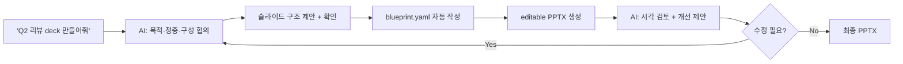

# User Manual — ai-deck-compiler

AI와 대화하면서 발표 자료를 빠르게 만드는 방법을 안내합니다.
엔진 구조나 renderer를 수정하려면 [SYSTEM-MANUAL](SYSTEM-MANUAL.md)을 보세요.

---

## 1. 이렇게 씁니다

Claude Code에서 한 줄이면 됩니다.

```text
/create-deck
```

그러면 AI가 질문합니다. "어떤 발표인가요? 청중은 누구인가요? 핵심 메시지가 있으신가요?"
답변을 주면 AI가 슬라이드 구성을 제안하고, 확인을 받은 뒤 `blueprint.yaml`을 작성하고, PPTX를 생성합니다.

생성된 파일은 PowerPoint에서 바로 편집할 수 있습니다. chart, table, 도형이 이미지가 아닌 PowerPoint 객체로 만들어집니다.

**사용자가 하는 일:**
1. AI와 대화한다 — 주제, 청중, 핵심 메시지, 슬라이드 구성을 협의
2. 결과물을 검토한다 — blueprint 초안을 확인하고 수정 방향을 말함
3. 반복한다 — "3번 슬라이드 KPI 항목 하나 더 추가해줘" 같은 피드백으로 빠르게 정제

레이아웃, 좌표, 색상은 엔진이 design preset에 따라 처리합니다. AI가 즉흥 결정하지 않으므로 같은 blueprint와 preset이면 같은 구조와 레이아웃 규칙으로 생성됩니다.

---

## 2. 전체 흐름



---

## 3. 설치

```bash
git clone https://github.com/kyungseo/ai-deck-compiler.git
cd ai-deck-compiler
npm install
```

설치 후 Claude Code에서 `/create-deck`을 입력하면 바로 시작할 수 있습니다.

기본 design preset(`default-modern`)은 **Pretendard** 폰트를 사용합니다.
미설치 시 시스템 fallback 폰트로 렌더링되어 출력물 모양이 달라질 수 있습니다.

| OS | 설치 방법 |
| --- | --- |
| macOS | `brew install --cask font-pretendard` |
| Windows / Linux | [Pretendard 릴리스 페이지](https://github.com/orioncactus/pretendard)에서 다운로드 |

---

## 4. AI 요청 방법

### 4.1 사용 환경별 진입점

| 환경 | 진입 방법 |
| --- | --- |
| Claude Code | `/create-deck` 입력 후 요청 |
| Claude Code | `/generate-blueprint` — blueprint만 생성할 때 |
| Claude Code | `/review-deck` — 생성된 deck 검토·개선 |
| Claude Code | `/generate-architecture-slide` — 아키텍처 다이어그램 슬라이드만 생성할 때 |
| Codex CLI / App | repo skill `create-deck` 로드 후 요청 |
| Claude App | `skills/create-deck.md` 내용 참조 후 요청 |

### 4.2 요청 예시

**주제와 목적만 말할 때 (brief-first)**

```text
/create-deck

Q2 엔지니어링 성과 리뷰 deck을 만들어줘.
청중은 임원진이고, 15분 발표야.
핵심 메시지는 "플랫폼 안정성이 개선됐고 다음 분기에는 배포 자동화에 투자해야 한다"야.
dark theme로 해줘.
```

**작성해둔 자료가 있을 때 (source-first)**

```text
/create-deck

아래 markdown 보고서를 기반으로 고객 제안용 8장 deck을 만들어줘.
원문을 그대로 복붙하지 말고 핵심 주장과 근거만 뽑아줘.

[여기에 markdown 붙여넣기]
```

**AI에게 조사와 작성을 맡길 때 (AI-research-first)**

```text
/create-deck

"AI-native presentation workflow"를 주제로 10장짜리 소개 deck을 만들어줘.
대상은 스타트업 CTO들이고, 기술적이지만 너무 깊지 않게.
필요하면 자료 조사 범위와 출처 기준을 먼저 물어봐.
```

**아키텍처 슬라이드만 생성할 때**

```text
/generate-architecture-slide

API Gateway가 앞단에 있고, 뒤에 Auth Service와 Order Service가 붙어 있어.
Auth Service는 Redis를 쓰고, Order Service는 Kafka로 이벤트를 발행해.
외부 Client가 Gateway를 호출하는 구조야.
```

### 4.3 CLI 직접 실행 (디버깅·고급 사용자)

AI 없이 `blueprint.yaml`을 직접 작성하거나, 동작을 확인할 때 사용합니다.

```bash
# blueprint 검증
npm run validate -- --blueprint examples/sample/blueprint.yaml

# PPTX 생성
npm run deck -- \
  --blueprint examples/sample/blueprint.yaml \
  --output output/sample-v1.0.pptx

# Preview (LibreOffice + pdftoppm 필요, optional)
npm run preview -- output/sample-v1.0.pptx --out output/sample-preview

# PDF 내보내기
npm run export-pdf -- output/sample-v1.0.pptx
```

---

## 5. AI가 작성하는 blueprint

AI가 요청을 처리하면 `blueprint.yaml`이라는 중간 파일을 생성합니다. 사용자는 이 파일을 직접 편집하거나 AI에게 수정을 요청합니다.

blueprint는 "어떤 슬라이드를 어떤 내용으로 만들지"를 기술하는 deck 전용 DSL(Domain Specific Language)입니다. 좌표와 레이아웃은 없습니다 — 엔진이 처리합니다.

---

## 6. Blueprint 기본 개념

### 6.0 제공 예제

repo에 세 가지 예제가 포함되어 있습니다. 처음 시작할 때 가장 비슷한 형식을 골라 수정하면 됩니다.

| 예제 | 경로 | 시나리오 | 사용된 slide type |
| --- | --- | --- | --- |
| sample | `examples/sample/` | 엔지니어링 플랫폼 전략 발표 | hero, agenda, kpi, architecture, chart, timeline, summary, appendix |
| strategy | `examples/strategy/` | 경영진 대상 제품 전략 보고 | hero, agenda, content, kpi, decision, summary |
| data-report | `examples/data-report/` | 분기 비즈니스 데이터 리뷰 | kpi, chart × 2, table, summary |

```bash
# 원하는 예제를 골라 실행
npm run validate -- --blueprint examples/strategy/blueprint.yaml
npm run deck -- --blueprint examples/strategy/blueprint.yaml
```

`blueprint.yaml`은 deck의 title, design, theme, metadata, slide list를 담습니다.

```yaml
deck:
  title: Platform Modernization Strategy
  design: default-modern
  theme: dark
  version: "1.0"
  author: Platform Team
  audience: Engineering Leadership

slides:
  - id: hero
    type: hero
    title: Platform Modernization Strategy
    subtitle: From monolith operations to cloud-native delivery
```

**파일 저장 위치 관례:**

```text
blueprints/          ← blueprint 파일을 여기에 저장합니다
  q2-review.yaml
  platform-modernization.yaml

output/              ← 생성된 PPTX가 여기에 저장됩니다 (.gitignore 권장)
  q2-review-v1.0.pptx
```

`/create-deck`을 사용하면 AI가 `blueprints/` 디렉터리를 자동으로 생성합니다.
`output/` 디렉터리는 `.gitignore`에 추가해두는 것을 권장합니다.

중요한 규칙:

- `deck.design`은 사용할 design preset 이름입니다.
- `deck.theme`은 `light` 또는 `dark`입니다.
- `deck.version`은 표지와 PPTX metadata 추적에 사용됩니다.
- `deck.author`는 표지와 PPTX creator metadata에 반영됩니다.
- slide `type`은 지원되는 16개 type 중 하나여야 합니다.
- 좌표는 쓰지 않습니다. 레이아웃은 엔진이 계산합니다.
- `slide.notes`에 텍스트를 넣으면 PowerPoint 발표자 노트로 저장됩니다. 슬라이드 화면에 표시되지 않으므로 발표 중 참고할 내용을 자유롭게 쓸 수 있습니다.

---

## 7. 지원 Slide Type

| 목적 | Type |
| --- | --- |
| 표지 | `hero` |
| 목차 | `agenda` |
| 일반 설명 | `content`, `two-column` |
| 요약/마무리 | `summary`, `closing` |
| 데이터 | `kpi`, `chart`, `table` |
| 비교/결정 | `comparison`, `decision` |
| 흐름/일정 | `timeline`, `flow` |
| 구조/아키텍처 | `architecture` |
| 구분/부록 | `section-divider`, `appendix` |

---

## 8. Preset, Theme, Branding

기본 preset은 `default-modern`입니다.

| 항목 | 설명 |
| --- | --- |
| `default-modern` | modern, minimal, technical한 deck에 적합 |
| `light` | 비즈니스/보고서 톤 |
| `dark` | 기술/엔지니어링/컨퍼런스 톤 |
| brand footer | footer 우측에 brand 표시 |
| page number | 표지를 제외한 slide에 page number 표시 |

기본 author는 다음 값입니다.

```text
ai-deck-compiler (Kyungseo.Park@gmail.com)
```

deck마다 다른 작성자를 쓰려면 blueprint에 `deck.author`를 넣거나 `/create-deck` 초기 질문에서 작성자/팀명을 알려주세요.

---

## 9. Customization 방법

### 9.1 가볍게 바꾸기

가벼운 branding은 `deck.author`, 발표 title, theme, output filename만으로도 충분합니다.

```yaml
deck:
  title: Company AI Strategy
  design: default-modern
  theme: light
  version: "1.0"
  author: Acme Strategy Team
  audience: Executive Committee
```

### 9.2 Brand footer 바꾸기

brand footer는 preset token에서 관리합니다.
현재 기본 preset 위치:

```text
src/design/presets/default-modern/tokens.json
```

팀/회사 브랜드를 계속 쓸 예정이면 custom preset을 만드는 편이 좋습니다.

### 9.3 Custom preset 만들기

custom preset은 다음 자료를 기반으로 만들 수 있습니다.

- 회사 PPT 스크린샷
- 브랜드 가이드 PDF/문서
- 기존 PPT 템플릿
- 주요 색상, 폰트, 로고 사용 규칙

AI 요청 예시:

```text
custom preset을 만들고 싶어.
우리 회사 브랜드 가이드와 기존 발표 자료 캡처를 줄게.

목표:
- 회사 색상과 폰트를 반영
- footer에 "Acme AI Lab" 표시
- 기술 발표용 dark theme와 임원 보고용 light theme 둘 다 지원
- 기존 default-modern 레이아웃 밀도는 유지

먼저 필요한 자료 목록과 preset 이름을 제안해줘.
```

레이아웃 조정 요청 예시:

```text
default-modern 기반으로 우리 팀용 preset을 만들고 싶어.
표지는 더 여백 있게, kpi slide는 숫자를 더 크게,
architecture slide는 node 간 간격을 넓혀줘.
수정 대상 파일과 검증 방법을 먼저 계획해줘.
```

---

## 10. Metadata와 Version 관리

`deck` metadata는 PPTX document properties에도 반영됩니다.

| Blueprint field | PPTX metadata |
| --- | --- |
| `deck.title` | `dc:title` |
| `deck.author` | `dc:creator` |
| `deck.title + deck.audience` | `dc:subject` |
| `deck.version` | `cp:revision`용 안전한 정수 값 |
| preset brand name | `Company` |

파일명은 version을 포함하는 형태를 권장합니다.

```bash
npm run deck -- \
  --blueprint blueprints/platform-modernization.yaml \
  --output output/platform-modernization-v1.0.pptx
```

---

## 11. Preview와 Review Loop

PPTX 생성 후 AI는 preview 생성 가능 여부를 판단하고, 사용자에게 다음과 같이 질문합니다.

```text
preview PNG를 생성해서 visual review까지 진행할까요?
```

사용자가 승인하면:

```bash
npm run preview -- output/platform-modernization-v1.0.pptx --out output/platform-modernization-preview
```

AI review 항목:

- 제목과 본문 overflow
- 하단 빈 공간
- chart/table 가독성
- theme/preset 일관성
- metadata가 blueprint와 일치하는지
- slide 흐름과 메시지 강도

수정이 필요하면 blueprint를 고치고 다시 validate/deck/preview를 반복합니다.

### PDF 내보내기

PPTX를 PDF로 변환하려면 `/export-pdf` 또는 `npm run export-pdf`를 사용합니다.

```bash
npm run export-pdf -- output/platform-modernization-v1.0.pptx
# 출력 경로 지정 시:
npm run export-pdf -- output/platform-modernization-v1.0.pptx --out output/platform-modernization.pdf
```

LibreOffice가 설치되어 있어야 합니다.

| OS | 설치 방법 |
| --- | --- |
| macOS | `brew install --cask libreoffice` |
| Ubuntu/Debian | `sudo apt install libreoffice` |
| Windows | [libreoffice.org/download](https://www.libreoffice.org/download/) |

LibreOffice가 없으면 CLI가 OS에 맞는 설치 안내를 출력하고 종료합니다.

---

## 12. 자주 묻는 질문

### Q. blueprint라는 이름을 꼭 써야 하나요?

현재는 `blueprint.yaml`을 유지합니다.
사용자 입장에서는 PPT 기획서이고, 시스템 입장에서는 Deck Specification DSL입니다.
`deck.spec.yaml` 같은 rename은 호환성 영향이 큰 후속 major change 후보입니다.

### Q. 생성된 PPTX가 이미지인가요?

아닙니다.
텍스트, 차트, 표, 도형은 가능한 한 native editable PowerPoint 객체로 생성됩니다.

### Q. 같은 blueprint인데 결과가 달라질 수 있나요?

같은 blueprint와 preset이면 같은 구조와 레이아웃 규칙으로 생성됩니다.
단, 폰트 설치 여부나 LibreOffice 버전에 따라 preview 결과가 달라 보일 수 있습니다.
구조적으로 다르다면 blueprint, preset token, dependency version 차이를 확인하세요.

### Q. PowerPoint 없이 preview할 수 있나요?

가능합니다.
`npm run preview`는 LibreOffice와 `pdftoppm`을 사용해 PPTX를 PNG로 변환합니다.
다만 이 도구들이 설치되어 있지 않으면 PowerPoint/Keynote 수동 확인으로 대체하세요.

### Q. 더 자세한 구조는 어디서 보나요?

- 개발 구조: [SYSTEM-MANUAL](SYSTEM-MANUAL.md)
- 설계와 roadmap: [PLAN](PLAN.md)
- AI skill 절차: `skills/*.md`

---

## 13. 문제 해결

### 출력물 폰트가 이상하게 보여요

Pretendard 폰트가 설치되지 않으면 시스템 fallback 폰트로 렌더링됩니다.
[§3 설치](#3-설치)의 폰트 설치 안내를 따라 설치한 뒤 다시 생성하세요.

### `npm run preview`가 실패해요

LibreOffice와 `pdftoppm`(poppler) 설치 여부를 확인하세요.
설치되지 않은 환경에서는 PowerPoint/Keynote에서 직접 열어 확인하세요.

### `npm run validate`가 오류를 내요

오류 메시지에 어떤 슬라이드의 어떤 필드가 문제인지 명시됩니다.
가장 흔한 원인:
- 지원하지 않는 slide `type` 사용
- 필수 필드(`id`, `type`, `title`) 누락
- `kpis`, `chart.data` 등 타입별 필수 구조 누락

전체 schema: `schemas/blueprint.schema.json`

더 자세한 개발·시스템 문제는 [SYSTEM-MANUAL §9 문제 해결](SYSTEM-MANUAL.md#9-문제-해결)을 참고하세요.
