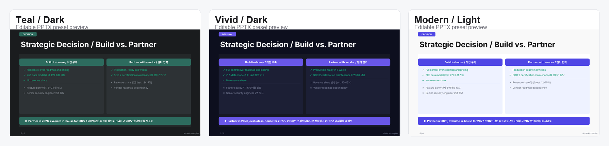

# Example Blueprint & PPTX Results

이 디렉터리는 대표 preset/theme별로 재생성 가능한 blueprint와 PPTX 예제를 보관합니다.
예제 내용은 영문 headline과 한국어 설명이 함께 들어간 bilingual strategy deck입니다.



포함 기준:

- `strategy-teal-dark.blueprint.yaml` / `strategy-teal-dark.pptx` — 신규 deck 기본 추천 경험 (`teal + dark`)
- `strategy-vivid-dark.blueprint.yaml` / `strategy-vivid-dark.pptx` — secondary preset preview (`vivid + dark`)
- `strategy-modern-light.blueprint.yaml` / `strategy-modern-light.pptx` — light/business tone preview (`modern + light`)
- `preset-gallery.png` — README용 preset gallery 이미지

재생성:

```bash
npm run deck -- --blueprint examples/results/strategy-teal-dark.blueprint.yaml --output examples/results/strategy-teal-dark.pptx
npm run deck -- --blueprint examples/results/strategy-vivid-dark.blueprint.yaml --output examples/results/strategy-vivid-dark.pptx
npm run deck -- --blueprint examples/results/strategy-modern-light.blueprint.yaml --output examples/results/strategy-modern-light.pptx
```

`teal`과 `vivid`의 light theme은 현재 dark fallback이므로 별도 결과물을 보관하지 않습니다.
